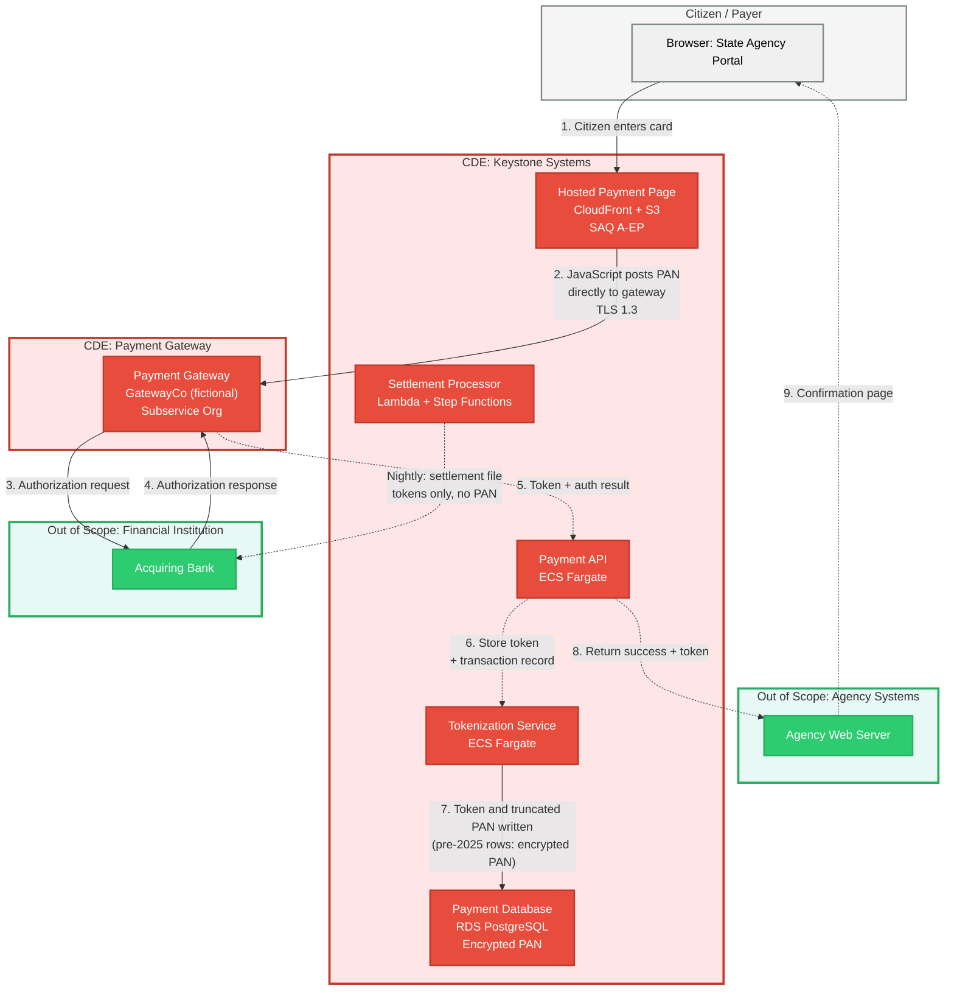
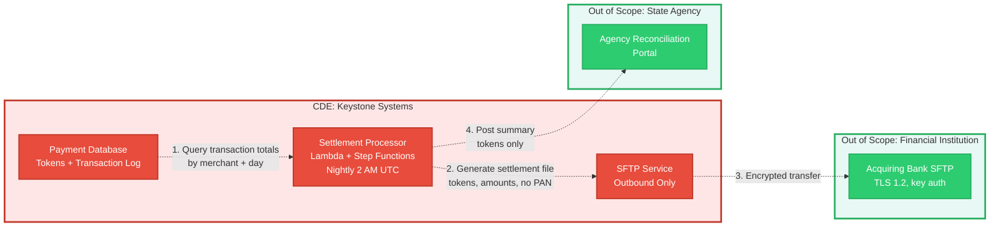
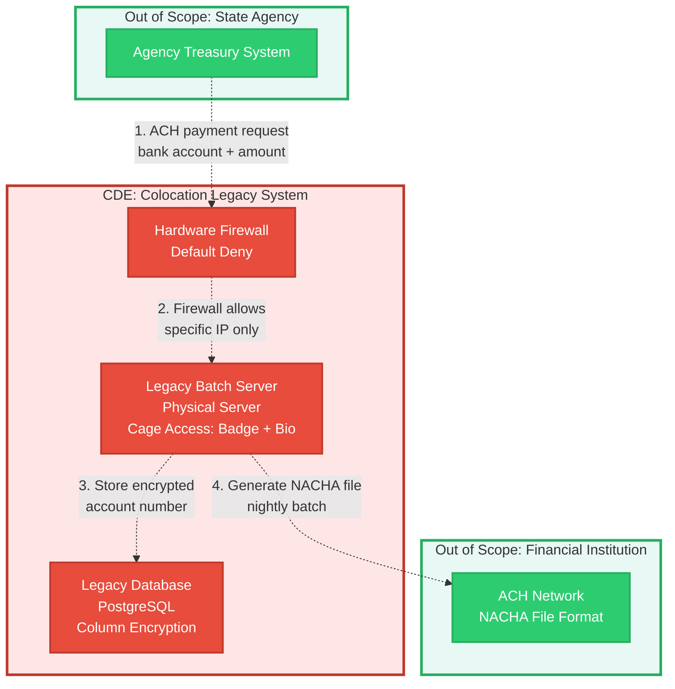

# Cardholder Data Flow Diagram

**Fictional company, sample data, for portfolio demonstration only.**

This diagram shows how cardholder data flows through Keystone Civic Payments' systems from initial capture to storage and settlement.

## Diagram Legend

- **Red boxes:** Cardholder Data Environment (CDE) components that store, process, or transmit PAN
- **Orange boxes:** Connected-to systems that can affect CDE security but do not handle PAN (Session Manager bastion, CI/CD pipeline, backup service, and monitoring are listed in system-description.md but not shown in these payment data flows; they connect to CDE infrastructure, not payment transaction paths)
- **Green boxes:** Out-of-scope systems with tested segmentation
- **Solid lines:** Data flows containing or potentially containing PAN (including encrypted PAN)
- **Dashed lines:** Data flows with tokens or non-card data only, no PAN

## Flow 1: Card Not Present (CNP) Transaction via Hosted Payment Page

**Key scoping notes for Flow 1:**

- The hosted payment page is CDE because it captures PAN, even though it immediately posts to the gateway. Keystone is responsible for PCI DSS 6.4.3 (script inventory and justification) and 11.6.1 (change and tamper detection). [See CHG-07 and CHG-08 in the control matrix.](../02-control-matrix/)
- The agency's web server never receives PAN, so it remains out of Keystone's CDE scope. The agency operates under SAQ A-EP or its own validation as a merchant.
- The gateway (GatewayCo) is a subservice organization. Keystone relies on GatewayCo's PCI DSS validation and reviews its AOC annually.
- Encrypted PAN from before Q1 2025 remains in the database for legacy reporting until the DAT-01 purge. New transactions store gateway tokens and truncated PAN only.

## Flow 2: Settlement and Reconciliation

**Key scoping notes for Flow 2:**

- Settlement files contain tokens and transaction amounts, not PAN. The acquiring bank receives its settlement data from the gateway separately.
- Agency reconciliation portal is out of scope because it receives tokens only, not PAN. Agencies can view transaction summaries but not decrypt stored PAN.

## Flow 3: Legacy ACH Batch System (Colocation)

**Why this system is in the CDE:** Per system-description.md: "Legacy batch server (physical server): Processes ACH files and **legacy card batch settlements** for two state agencies not yet migrated to the API platform." The card batch settlement processing makes this a CDE component. The ACH flow shown above uses dashed lines (ACH bank account numbers are not PCI account data). Card batch settlement flows would use solid lines with PAN, but those flows follow a similar path through the same infrastructure.

**Key scoping notes for Flow 3:**

- Physical security is tested as part of PCI DSS Requirement 9. The colocation facility provides badge and biometric access, video surveillance, and visitor logs. [See PHY-01 in the control matrix.](../02-control-matrix/)
- This system is out of GovRAMP scope because the two state agencies using it are not GovRAMP participants.

## Data Retention and Destruction

- **PAN retention:** Encrypted PAN is retained for 18 months per business justification (dispute resolution and agency audit requirements), then securely deleted per DAT-01. A quarterly automated purge job removes PAN past its retention period.
- **Token retention:** Tokens are retained for 7 years per state record-keeping requirements. Tokens cannot be used to reconstruct PAN without access to the gateway's detokenization API, which requires separate authentication and logging.
- **Log retention:** Audit logs are retained for 12 months with 3 months immediately searchable in the SIEM, per PCI DSS 10.5.1 and GovRAMP ConMon requirements.

## Segmentation Controls Summary

The CDE is segmented from corporate and out-of-scope systems using:

1. **AWS account boundaries:** Production payment systems run in a dedicated AWS account with no cross-account access from corporate or sandbox accounts. SCPs prevent privilege escalation.
2. **VPC and security groups:** Default-deny security groups restrict traffic to necessary ports and protocols only. VPC Flow Logs monitor all network traffic.
3. **Transit Gateway route tables:** On-premises connectivity (colocation to AWS) flows through Transit Gateway with explicit route tables. No default route to the internet from CDE databases.
4. **Colocation hardware firewall:** Legacy system protected by a stateful firewall with explicit allow rules for the two state agencies only. All other traffic denied by default.

**Segmentation testing cadence:** At least every six months per PCI DSS 11.4.6 (service provider requirement), covering all segmentation methods in use. The September 2025 segmentation retest in the PCI DSS Network Segmentation project shaped the current design (CDE-dedicated Splunk index, Session Manager in place of the bastion, semiannual cadence). [See VUL-05 in the control matrix and the existing PCI DSS Network Segmentation project for detailed testing approach.](../02-control-matrix/)

## Change Impact on Data Flows

Any change to these flows triggers a scope impact review (PCI DSS 6.5.2 and 12.5.2.1):

- New payment channel (example: mobile app, recurring billing API)
- New subservice organization or gateway
- Migration of legacy batch system to AWS (planned for Q3 2027)
- New data export or integration with state agency back-office systems

Each change is documented in ServiceNow with a "significant change" flag, reviewed by the Director of GRC, and confirmed before production deployment. [See GOV-05 and CHG-06 in the control matrix.](../02-control-matrix/)
